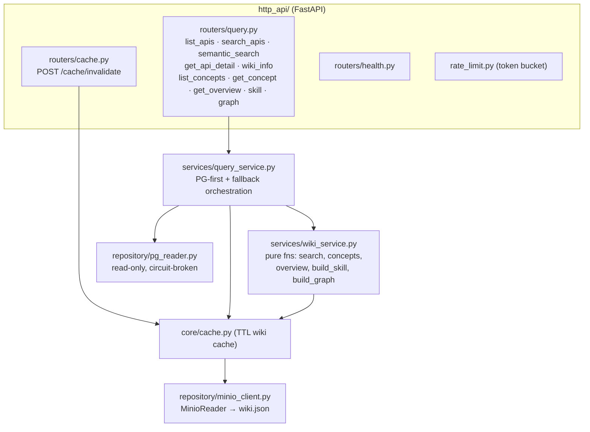
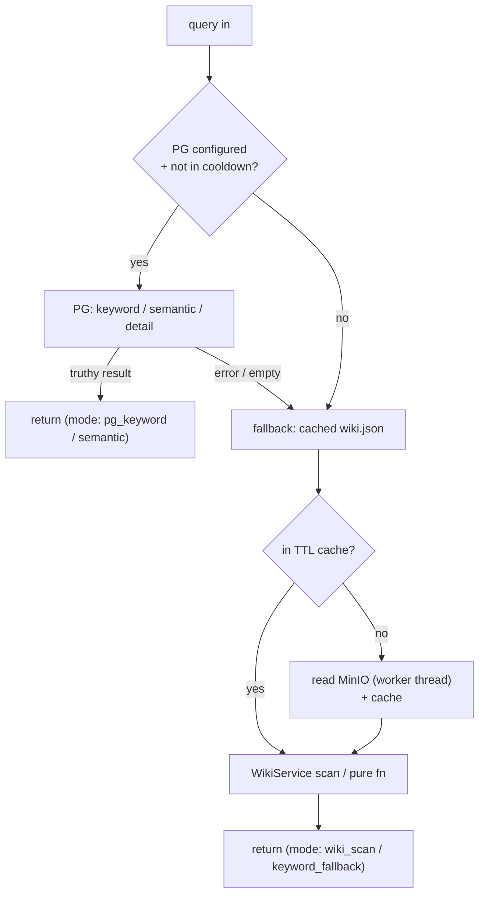

# mcp-server — architecture

Read-only query service. Layered: `http_api/` (routers) → `services/`
(query logic + pure wiki functions) → `repository/` (MinIO + PG readers).
Every read is PG-first with cached-wiki fallback.

## Internal layering

## Read path (PG-first, always answerable)

Concepts, overviews, skill, and graph read **only** the cached `wiki.json` (no PG
path) — wiki-processor produces `concepts`/`overviews`; mcp-server just serves
them. See [`docs/api.md`](../api.md) for endpoint shapes.
