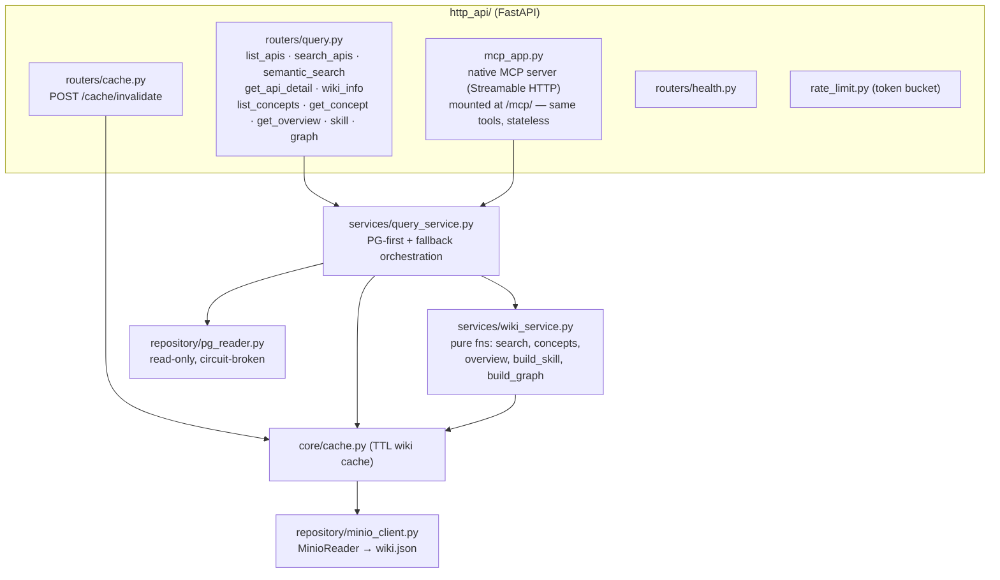

# mcp-server —— 架構

唯讀查詢服務。分層：`http_api/`（路由）→ `services/`（查詢邏輯 + 純 wiki 函式）
→ `repository/`（MinIO + PG 讀取器）。每次讀取都 PG 優先、可退回快取 wiki。

## 內部分層

## 讀取路徑（PG 優先，永遠答得出來）

```mermaid
flowchart TD
    Q["query in"] --> PG{"PG configured<br/>+ not in cooldown?"}
    PG -->|yes| TRY["PG: keyword / semantic / detail"]
    TRY -->|truthy result| RET["return (mode: pg_keyword / semantic)"]
    TRY -->|error / empty| FB
    PG -->|no| FB

    FB["fallback: cached wiki.json"] --> CHK{"in TTL cache?"}
    CHK -->|no| LOAD["read MinIO (worker thread)<br/>+ cache"]
    CHK -->|yes| SCAN
    LOAD --> SCAN["WikiService scan / pure fn"]
    SCAN --> RET2["return (mode: wiki_scan / keyword_fallback)"]
```

概念（concepts）、總覽（overviews）、skill、graph **只**讀快取的 `wiki.json`（不走 PG）
—— `concepts`/`overviews` 由 wiki-processor 產生，mcp-server 只負責提供。
端點格式見 [`docs/api.md`](../api.md)。

> 名詞：**circuit breaker（斷路器）** = PG 連續失敗就暫時跳過、走 fallback，避免一直撞死節點；
> **TTL cache** = 結果暫存一段時間（time-to-live）。
</content>
